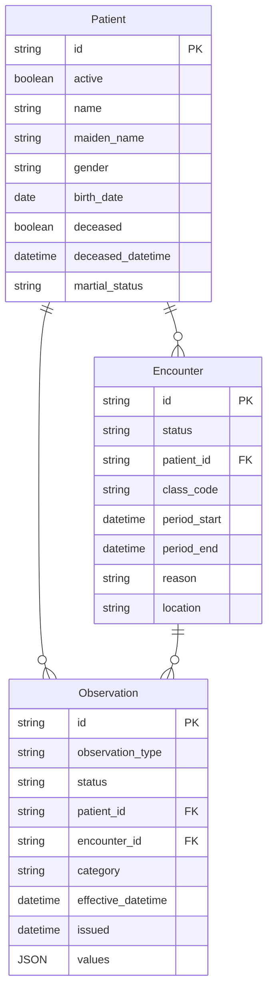

# ER Diagram

```mermaid
erDiagram
  "Patient" {
    string id PK
    boolean active
    string name
    string maiden_name
    string gender
    date birth_date
    boolean deceased
    datetime deceased_datetime
    string martial_status
  }

  "Encounter" {
    string id PK
    string status
    string patient_id FK
    string class_code
    datetime period_start
    datetime period_end
    string reason
    string location
  }

  "Observation" {
    string id PK
    string observation_type
    string status
    string patient_id FK
    string encounter_id FK
    string category
    datetime effective_datetime
    datetime issued
    JSON values
  }

  "Patient" ||--o{ "Encounter" : ""
  "Patient" ||--o{ "Observation" : ""
  "Encounter" ||--o{ "Observation" : ""
```
