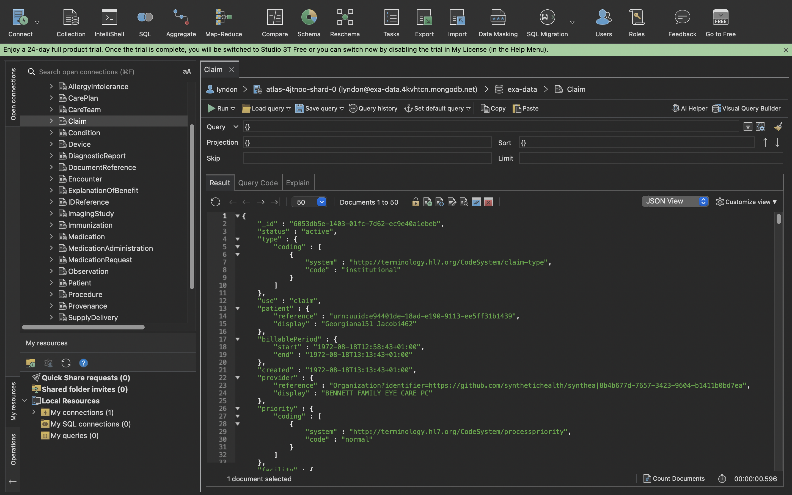
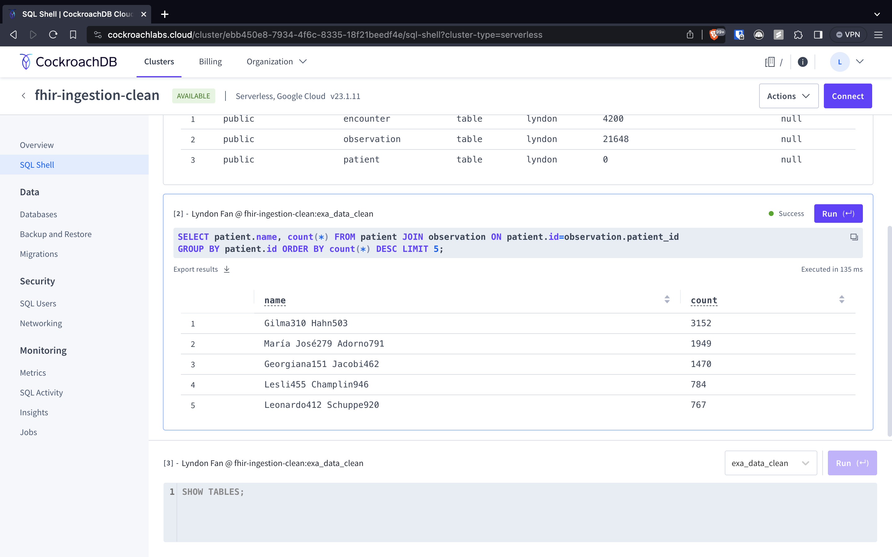

# Processing FHIR Data

This is a project that processes and stores FHIR data. Given a folder of jsons, we load them into Mongo and SQL databases like so:





## Usage

### Quickstart

1. Set up a Mongo and a Postgres database.
2. Using .env.template as a reference, create and populate a new .env file.
3. Create a new virtual environment using venv and requirements.txt or poetry and pyproject.toml
4. Run `python -m src.db.schema` to set up SQL tables.
5. Run `python main.py data` for the main pipeline.

### Databases

Regardless of which method is used below, we first need to create the databases to store the data. Keep note of your credentials after creating.

-   a Mongo database.
-   a PostgreSQL database or CockroachDB. (For other SQL databases, please also install the corresponding library/driver after activating the virtual environment.)

### Populating the .env File

The .env file is used to store various variables. Here it is used to store the database details (though the author acknowledges this may not be the most secure method). See the [.env.template](/.env.template) file for reference.

### From Source

After downloading this repository, create a new virtual environment by

```bash
python -m venv .venv
source .venv/bin/activate
pip install  -r requirements.txt
```

Alternatively, if you use [poetry](https://python-poetry.org/), you can do

```bash
poetry shell
poetry install
```

After installing and activating the environment, first run below to set up the SQL tables:

`python -m src.db.schema`

Then you can run the main pipeline by

`python main.py <DIRECTORY_OF_JSON_DATA>`

To do this with the provided data, for example, run

`python main.py data`

### From Docker Image

1. Create the Mongo and SQL databases as above.
2. Create the .env file as above.
3. Run `docker build -t <YOUR_IMAGE_NAME> .`
4. Run `docker-compose up`

Note the image will mount the secret file at `$PSQL_SSL_ROOT_CERT` to the same place in the image. It is noted this isn't best practice, but the author was unable to figure out docker secrets proper in the given timeframe.
